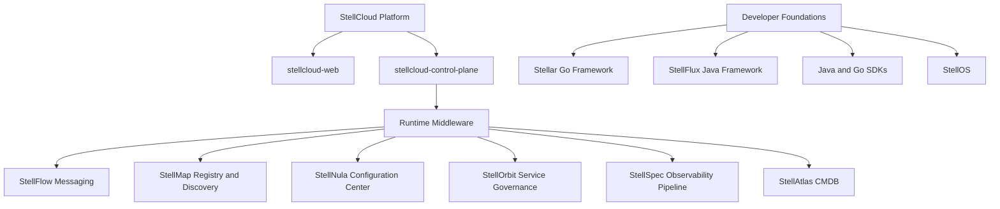

  <h1>Stell Hub</h1>

  

    A cloud-native middleware and infrastructure product matrix for building reliable,
    observable, governable, and platform-ready distributed systems.
  

  

    
    
    
  

---

## What Is Stell Hub?

Stell Hub is an open product family for cloud-native middleware, platform control planes, language SDKs, and infrastructure foundations. It is organized around one idea: distributed systems should be reliable by default, observable in production, governable at runtime, and easy to operate from a unified cloud platform.

The Stell series covers messaging, service discovery, configuration management, service governance, observability, CMDB, operating system foundations, Java and Go SDKs, and framework integrations.

## Product Landscape

## Core Products

| Product | Repository | Role |
| --- | --- | --- |
| StellCloud | [stellcloud-web](https://github.com/stellhub/stellcloud-web), [stellcloud-control-plane](https://github.com/stellhub/stellcloud-control-plane) | Unified frontend and backend control plane for operating Stell middleware products. |
| Stellar | [stellar](https://github.com/stellhub/stellar) | Go framework that unifies Stell middleware standards, configuration, discovery, messaging, observability, and platform integration. |
| StellFlux | [stellflux](https://github.com/stellhub/stellflux) | Java Spring Boot framework and starter collection for Stell middleware integration. |
| StellFlow | [stellflow-service](https://github.com/stellhub/stellflow-service) | Cloud-native message queue service for reliable messaging, pub/sub workloads, and event streaming. |
| StellMap | [stellmap-service](https://github.com/stellhub/stellmap-service) | Service registry, discovery, metadata, routing, and topology foundation for distributed applications. |
| StellNula | [stellnula-service](https://github.com/stellhub/stellnula-service) | Configuration center for dynamic configuration delivery, synchronization, rollout, and audit workflows. |
| StellOrbit | [stellorbit-service](https://github.com/stellhub/stellorbit-service) | Service governance engine for routing, load balancing, retries, traffic shifting, and lifecycle policies. |
| StellSpec | [stellspec-service](https://github.com/stellhub/stellspec-service), [stellspec-console](https://github.com/stellhub/stellspec-console) | Observability pipeline for consuming OpenTelemetry logs, storing them in Elasticsearch, and querying them through SQL-like syntax. |
| StellAtlas | [stellatlas-service](https://github.com/stellhub/stellatlas-service) | CMDB service for configuration items, asset inventory, topology relationships, and lifecycle metadata. |
| StellO11y | [stello11y-opentelemetry-collector](https://github.com/stellhub/stello11y-opentelemetry-collector) | Custom OpenTelemetry Collector distribution for logs, metrics, traces, and StellHub telemetry pipelines. |
| StellOS | [stellos](https://github.com/stellhub/stellos) | Rust-first minimal enterprise operating system distribution foundation for secure and reproducible infrastructure workloads. |

## Platform And Console Layer

| Area | Repository | Description |
| --- | --- | --- |
| Unified frontend | [stellcloud-web](https://github.com/stellhub/stellcloud-web) | TypeScript frontend entry point for all Stell middleware products and cloud platform workflows. |
| Unified control plane | [stellcloud-control-plane](https://github.com/stellhub/stellcloud-control-plane) | Backend control plane that aggregates configuration management and service governance APIs. |
| Messaging console | [stellflow-console](https://github.com/stellhub/stellflow-console) | Management console for operating StellFlow in the StellCloud platform. |
| StellMap console | [stellmap-console](https://github.com/stellhub/stellmap-console) | Management console for operating StellMap in the StellCloud platform. |

## SDKs And Client Libraries

| Product | Java | Go |
| --- | --- | --- |
| StellFlow | [stellflow-java-sdk](https://github.com/stellhub/stellflow-java-sdk) | [stellflow-go-sdk](https://github.com/stellhub/stellflow-go-sdk) |
| StellMap | [stellmap-java-sdk](https://github.com/stellhub/stellmap-java-sdk) | [stellmap-go-sdk](https://github.com/stellhub/stellmap-go-sdk) |
| StellNula | [stellnula-java-sdk](https://github.com/stellhub/stellnula-java-sdk) | [stellnula-go-sdk](https://github.com/stellhub/stellnula-go-sdk) |
| StellOrbit | [stellorbit-java-sdk](https://github.com/stellhub/stellorbit-java-sdk) | Planned |
| StellSpec | [stellspec-java-sdk](https://github.com/stellhub/stellspec-java-sdk) | [stellspec-go-sdk](https://github.com/stellhub/stellspec-go-sdk) |

## Foundation Repositories

| Repository | Purpose |
| --- | --- |
| [stell-bom](https://github.com/stellhub/stell-bom) | Maven BOM for dependency version alignment across the StellHub Java ecosystem. |
| [stellhub-foundation-java](https://github.com/stellhub/stellhub-foundation-java) | Shared Java foundation library for common models, conventions, utilities, and infrastructure abstractions. |
| [stell-web](https://github.com/stellhub/stell-web) | Official website and technical documentation portal for StellHub. |

## Operating Principles

| Principle | Meaning |
| --- | --- |
| Runtime governance | Service discovery, routing, retries, traffic shifting, configuration rollout, and lifecycle policy should be controlled centrally and applied consistently. |
| Observable by design | Logs, metrics, traces, events, and query workflows should be designed into the platform rather than bolted on later. |
| SDK-first integration | Java and Go applications should have first-class SDKs and framework adapters instead of hand-written integration glue. |
| Cloud platform ready | Middleware should expose OpenAPI/control-plane surfaces that can be operated through StellCloud. |
| Infrastructure continuity | StellOS, Stellar, StellFlux, BOMs, and foundation libraries provide the lower layers needed to build and operate the stack coherently. |

## Repository Naming

Stell Hub keeps repository names explicit and operational:

- `*-service`: runtime server component.
- `*-console`: product-specific console or query/control plane.
- `*-java-sdk` / `*-go-sdk`: language client SDK.
- `stellcloud-*`: unified cloud platform layer.
- `stellar` / `stellflux`: framework-level developer foundations.
- `stellos`: operating system distribution foundation.

## Documentation

- Website and documentation portal: <https://github.com/stellhub/stell-web>
- Product documentation sources: <https://github.com/stellhub/stell-web/tree/main/docs/products>
- Chinese product documentation: <https://github.com/stellhub/stell-web/tree/main/docs/zh/products>
- GitHub organization: <https://github.com/stellhub>

---

  <strong>Stell Hub builds the middleware, SDK, control-plane, and infrastructure foundations for reliable cloud-native systems.</strong>

    

  <h3>Follow the WeChat Official Account</h3>
  

