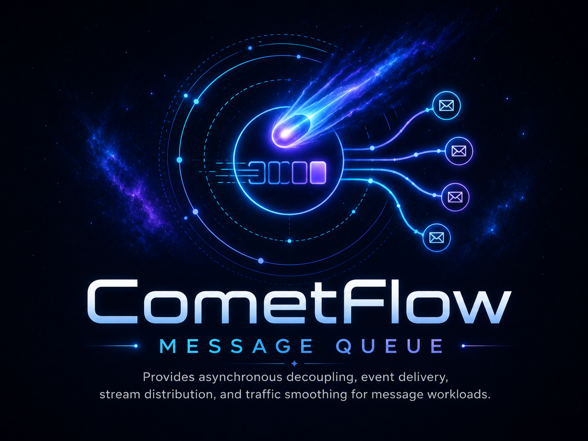
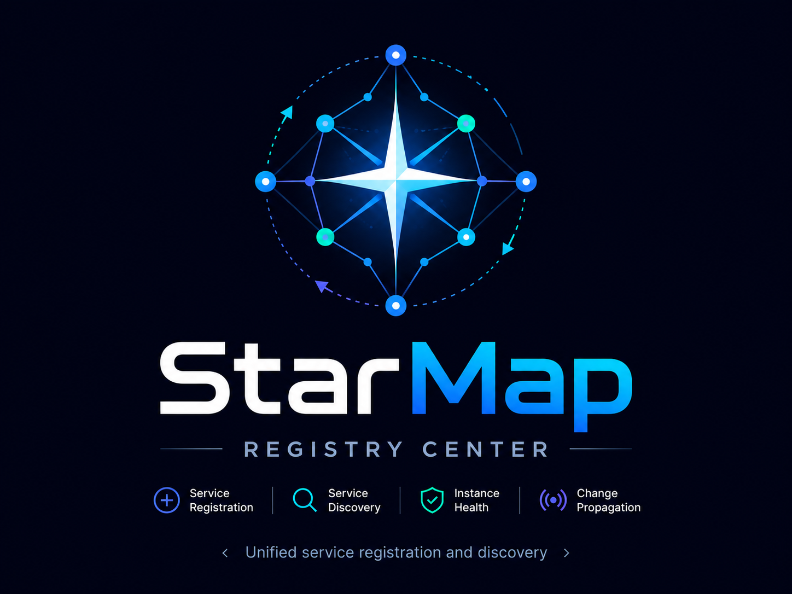
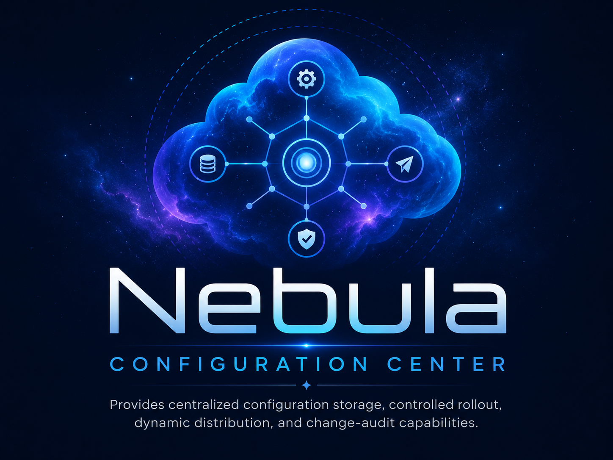
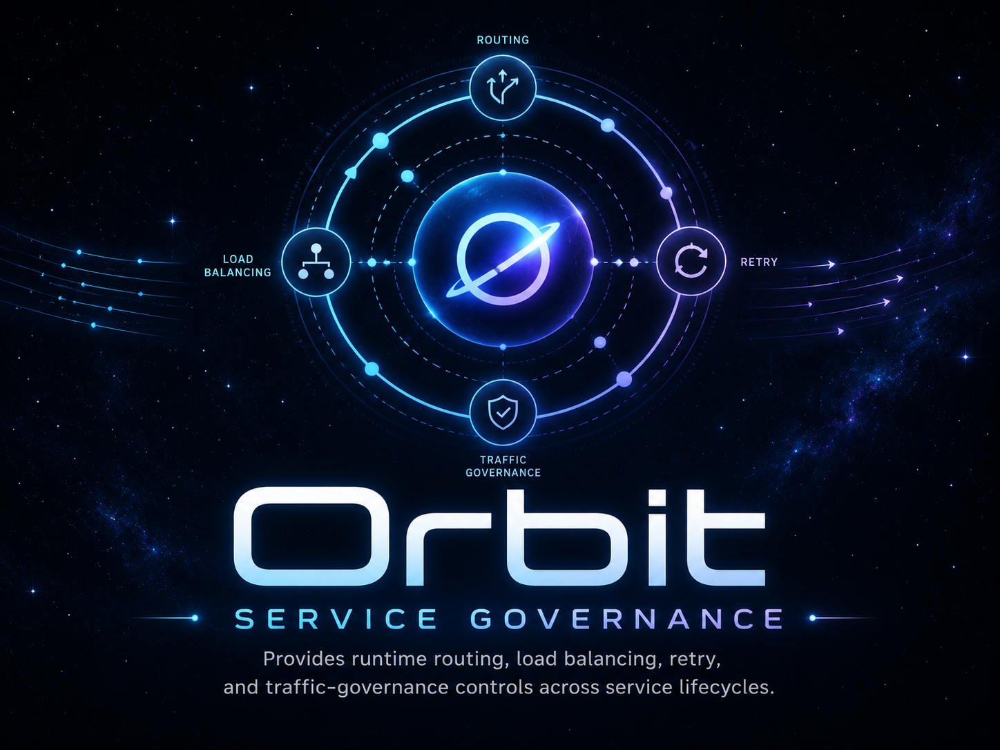
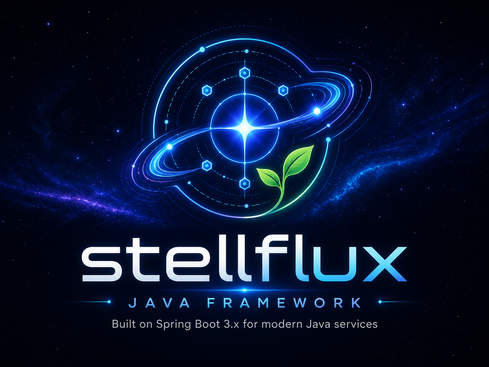

  

  <h1>Stell Hub</h1>

  

    A middleware product matrix for modern distributed systems, covering service discovery, configuration governance, traffic control, observability, security, and platform coordination.
  

  

    
    
    
  

---

## Product Matrix

Stell Hub organizes foundational middleware capabilities into product-level entry points that can evolve independently and work together as one coherent platform. Every product follows the same documentation structure: positioning, design overview, system architecture, deployment model, getting started, configuration guide, API and SDK reference, and observability guide.

<table>
  <tr>
    <td width="50%">
      
      <h3>Stellflow · CometFlow</h3>
      <strong>Message Queue</strong>
      
Provides asynchronous decoupling, event delivery, stream distribution, and traffic smoothing for message workloads.

      <a href="https://github.com/stellhub/stellflow">Read Reference</a>
    </td>
    <td width="50%">
      
      <h3>Stellmap · StarMap</h3>
      <strong>Registry Center</strong>
      
Provides unified service registration and discovery for instance health, subscriptions, and topology change propagation.

      <a href="https://github.com/stellhub/stellmap">Read Reference</a>
    </td>
  </tr>
  <tr>
    <td width="50%">
      
      <h3>Stellnula · Nebula</h3>
      <strong>Configuration Center</strong>
      
Provides centralized configuration storage, controlled rollout, dynamic distribution, and change-audit capabilities.

      <a href="https://github.com/stellhub/stellnula">Read Reference</a>
    </td>
    <td width="50%">
      
      <h3>Stellorbit · Orbit</h3>
      <strong>Service Governance</strong>
      
Provides runtime routing, load balancing, retry, and traffic-governance controls across service lifecycles.

      <a href="https://github.com/stellhub/stellorbit">Read Reference</a>
    </td>
  </tr>
  <tr>
    <td width="50%">
      
      <h3>Stellflux · Flux</h3>
      <strong>Data Flow Platform</strong>
      
Provides event-flow processing, pipeline orchestration, and stream transformation for real-time data movement.

      <a href="https://github.com/stellhub/stellflux">Read Reference</a>
    </td>
    <td width="50%">
    </td>
  </tr>
</table>

## Focus Areas

<table>
  <tr>
    <td><strong>Runtime Governance</strong> Service registration, configuration distribution, routing, load balancing, rate limiting, circuit breaking, and scheduling.</td>
    <td><strong>Observability</strong> Unified trace, log, metric, and alert signals for diagnosis, capacity analysis, and incident response.</td>
  </tr>
  <tr>
    <td><strong>Platform Security</strong> Zero-trust access, secret custody, certificate rotation, policy management, and audit workflows.</td>
    <td><strong>Distributed Coordination</strong> Lease locks, leader election, resource exclusion, event delivery, and traffic smoothing.</td>
  </tr>
</table>

## Documentation

- Product overview: <https://github.com/stellhub/stell-web/tree/main/docs/products>
- Chinese reference: <https://github.com/stellhub/stell-web/tree/main/docs/zh/products>
- Documentation repository: <https://github.com/stellhub/stell-web>

---

  <strong>Stell Hub builds a coherent middleware stack for reliable, observable, and governable distributed systems.</strong>

    

  <h3>Follow the WeChat Official Account</h3>
  

